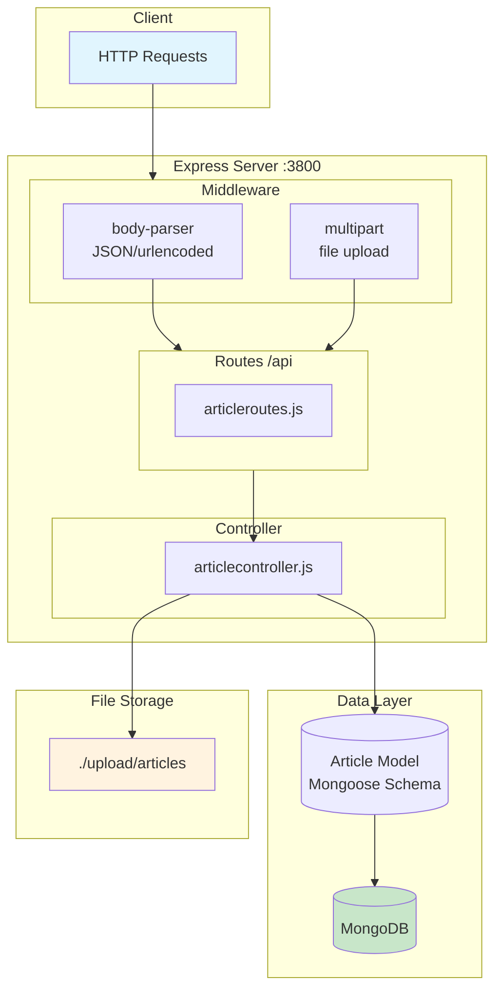
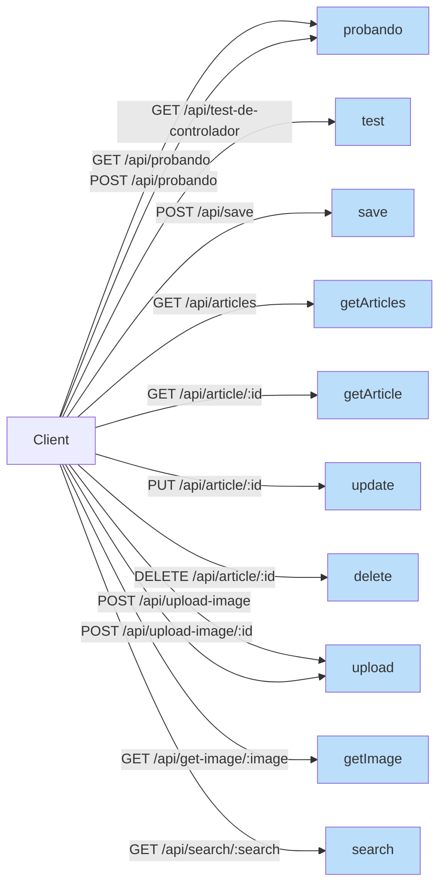
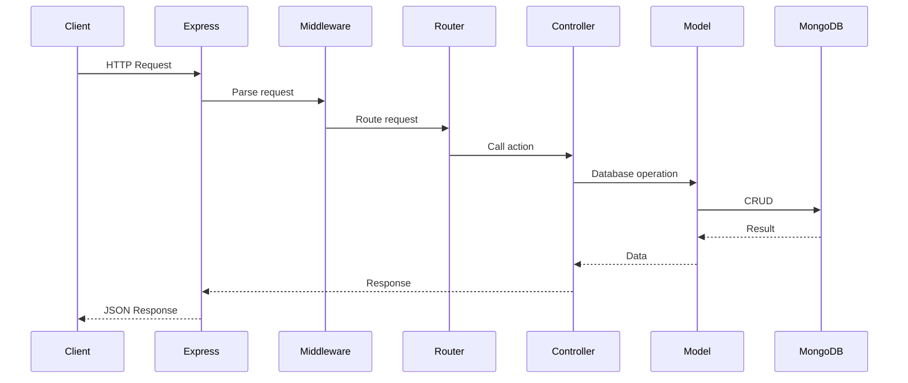

# Software Architecture Diagram

## Component Diagram



## API Routes



## Data Flow



## Tech Stack

| Layer | Technology |
|-------|------------|
| Runtime | Node.js |
| Framework | Express.js v5.2.1 |
| Database | MongoDB + Mongoose v9.4.1 |
| Middleware | body-parser v2.2.2, connect-multiparty v2.2.0 |
| Validation | validator v13.15.35 |

## Directory Structure

```
Backend/
├── index.js                  # Entry point
├── app.js                    # Express configuration
├── controllers/
│   └── articlecontroller.js  # Business logic
├── routes/
│   └── articleroutes.js      # API routes
├── models/
│   └── article.js            # Mongoose schema
└── upload/
    └── articles/             # File uploads
```
